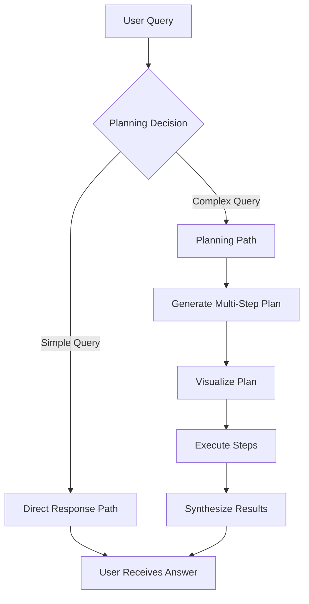
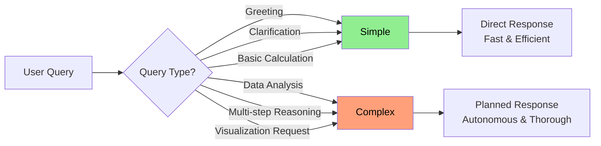
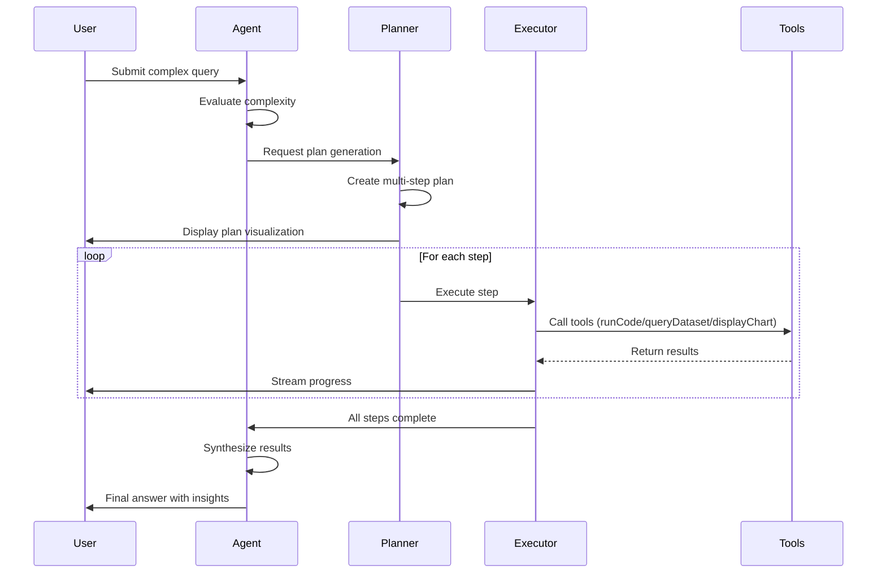

# Novablick

An AI-powered data analytics chat application that lets you analyze CSV datasets through natural language conversations.


## Features

- **Natural Language Data Analysis** - Ask questions about your datasets in plain English and get intelligent, context-aware responses
- **CSV Upload & Streaming Processing** - Upload CSV files of any size with efficient batch processing and automatic parsing
- **Multi-Dataset Support** - Work with multiple CSV files simultaneously and query across datasets in a single conversation
- **Automated Data Type Inference** - Automatically detects column types (string, number, integer, boolean, date) during upload
- **SQL Query Generation** - Automatically generates and executes secure SQL SELECT queries based on your questions with built-in injection protection
- **Python Code Execution** - Run Python data analysis code using Pyodide
- **Interactive Visualizations** - Automatically generate bar charts, line charts, and pie charts
- **Agentic Planning** - Complex queries are intelligently broken down into multi-step execution plans with real-time progress tracking
- **Virtual Scrolling** - Efficiently view and navigate large datasets with optimized rendering

## Agentic Workflow

Novablick uses an agentic workflow that autonomously decides how to handle user queries. The workflow adapts based on query complexity:

### Workflow Overview



### Decision Flow

The agent evaluates each query to determine the optimal approach:



### Execution Sequence

Here's how a complex query flows through the system:



### Available Tools

The agent has access to five tools during execution.
Chart tools are separated by type (bar, line, pie) with targeted examples, enabling the AI agent to select and generate visualizations more accurately.

#### 1. Python Code Execution (`runCode`)

Execute Python code using Pyodide:

- Support for data analysis libraries
- Matplotlib visualizations are automatically captured
- Results are streamed back in real-time
- Secure execution in Wasm sandbox

#### 2. Dataset Querying (`queryDataset`)

Query CSV datasets using SQL with built-in security:

- Filter, aggregate, and sort data
- Perform statistical analysis (COUNT, AVG, SUM, etc.)
- Join multiple columns and create custom calculations
- Securely limited to read-only SELECT queries on authorized datasets
- Automatic row limit protection (max 1000 rows per query)

#### 3. Bar Chart Display (`displayBarChart`)

Create interactive bar charts for comparing categorical data:

- Support for multiple data series
- Responsive design with tooltips

#### 4. Line Chart Display (`displayLineChart`)

Visualize trends and time-series data with line charts:

- Multiple lines for comparison
- Ideal for tracking changes over time

#### 5. Pie Chart Display (`displayPieChart`)

Show proportional data with pie/donut charts:

- Interactive tooltips
- Perfect for composition analysis

## Setup

### Docker

1. Create .env and add your `OPENAI_API_KEY`

```sh
cp .env.example .env
```

2. Start services

```sh
pnpm install
pnpm docker:up
```

3. Synchronize the database schema

```sh
pnpm docker:db:push
```

Open [http://localhost:3000](http://localhost:3000).

Other commands:

```sh
pnpm docker:down      # Stop services
pnpm docker:logs      # View logs
pnpm docker:build     # Rebuild images
```

### Local Development

The app runs on host, only the database in Docker.

1. Create .env and add your `OPENAI_API_KEY`

```sh
cp .env.example .env
```

2. Run the database

```sh
docker run -e POSTGRES_USER=postgres -e POSTGRES_PASSWORD=postgres -e POSTGRES_DB=novablick -p 5432:5432 postgres
```

3. Synchronize the database schema

```sh
pnpm install
pnpm db:push
```

4. Run the development server

```sh
pnpm dev
```

Open [http://localhost:3000](http://localhost:3000).
