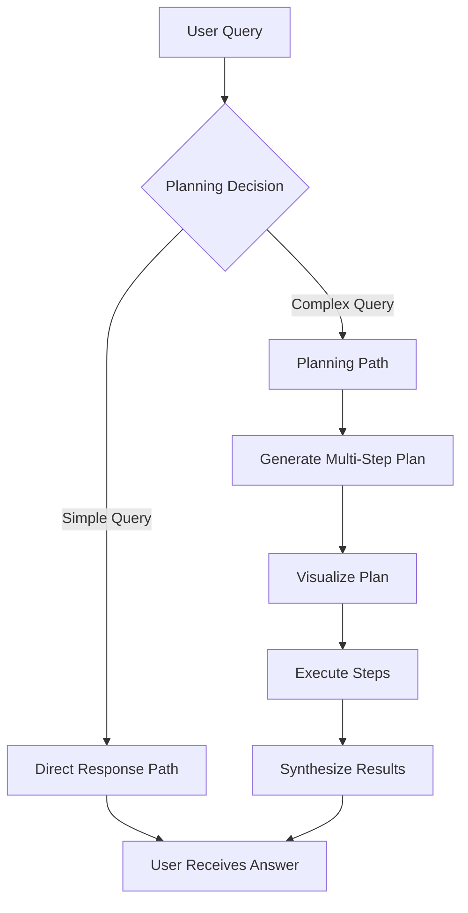
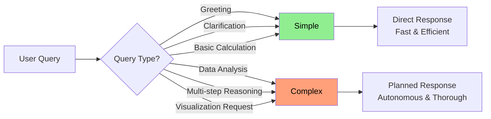
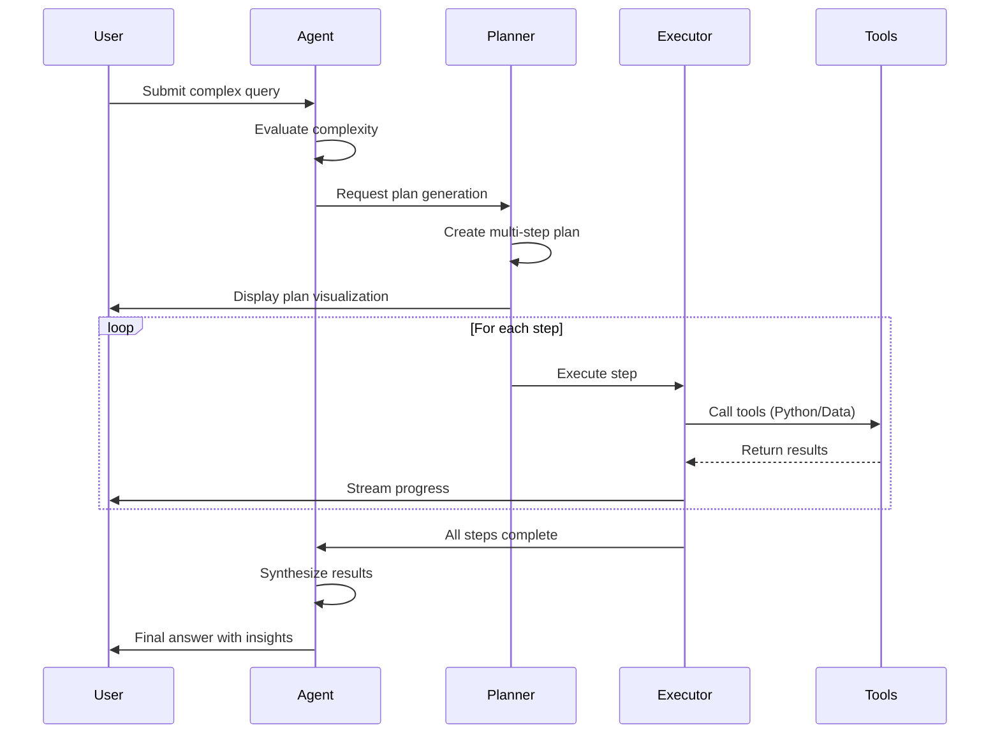

# Novablick

An AI-powered data analytics chat application that lets you analyze CSV datasets through natural language conversations.

## Agentic Workflow

Novablick uses an agentic workflow that autonomously decides how to handle user queries. The workflow adapts based on query complexity:

### Workflow Overview



### Decision Flow

The agent evaluates each query to determine the optimal approach:



### Execution Sequence

Here's how a complex query flows through the system:



### Python Code Execution

The agent can execute Python code using Pyodide (Python in the browser):

- Support for data analysis libraries
- Matplotlib visualizations are automatically captured
- Results are streamed back in real-time
- Secure execution in Wasm sandbox

## Setup

### Configure environment variables

```sh
cp .env.example .env
```

### Run the database

```sh
podman pull postgres
podman run -e POSTGRES_USER=postgres -e POSTGRES_PASSWORD=postgres -p 5432:5432 postgres
```

### Synchronize the database schema

```sh
pnpm db:push
```

### Run the development server

```sh
pnpm dev
```

Open [http://localhost:3000](http://localhost:3000) with your browser to see the result.
